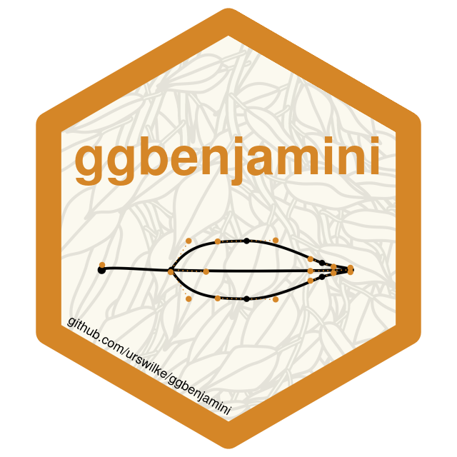

<!-- README.md is generated from README.Rmd. Please edit that file -->

```{r, include = FALSE}
knitr::opts_chunk$set(
  collapse = TRUE,
  comment = "#>",
  fig.path = "man/figures/README-",
  out.width = "100%"
)
```

# ggbenjamini  


<!-- badges: start -->
[](https://lifecycle.r-lib.org/articles/stages.html#experimental)
[](https://CRAN.R-project.org/package=ggbenjamini)
[](https://github.com/urswilke/ggbenjamini/actions)
[](https://codecov.io/gh/urswilke/ggbenjamini?branch=main)
<!-- badges: end -->

## Generate benjamini leaves with bezier curves

The goal of this package is to generate shapes in the form of ficus benjamina leaves ([weeping fig](https://en.wikipedia.org/wiki/Ficus_benjamina))
with bezier curves. It is heavily inspired by the awesome [flametree](https://flametree.djnavarro.net/) package.

## Installation

You can install the newest version of **ggbenjamini** from github with:

``` r
# install.packages("remotes")
# (if not installed yet)

remotes::install_github("urswilke/ggbenjamini")
```

## Usage

First load some libraries:

```{r loadlibs, message=FALSE}
library(ggbenjamini)
library(purrr)
library(dplyr)
library(tidyr)
library(ggplot2)
set.seed(123)
```

## Illustration of the generated data

The package generates bezier curves that imitate the shape of the leaves of a
ficus benjamini. 
The main function is `benjamini_leaf()`: 


```{r fun}
df <- benjamini_leaf()
print(df, n = 40)
```
It results in a dataframe of multiple bezier curves representing the shape of a leaf. 
The first column `element` indicates which part of the leaf the bezier describes, 
and can take the values 
`r glue::glue('"{unique(benjamini_leaf()$element)}"') %>% glue::glue_collapse(sep = ", ", last = " and ")`.
`i_part` denotes the id of the bezier curve, and `x` & `y` its point coordinates.
The column `param_type` denotes the type of the point in the bezier curve.

The meaning is best illustrated with a plot:
```{r def}
# rearrange data to display segments:
segments <- df %>% 
  select(-param_type) %>% 
  group_by(element, i_part) %>% 
  mutate(j = c(1, 2, 1, 2)) %>%
  ungroup() %>% 
  pivot_wider(
    names_from = j,
    values_from = c(x, y),
    values_fn = list
  ) %>% 
  unnest(c(x_1, x_2, y_1, y_2))

ggplot(df, aes(x = x, y = y)) + 
  geom_point(color = "red") +
  geom_point(data = df %>% group_by(element, i_part) %>% slice(c(1, 4)), color = "blue", size = 2) +
  geom_point(data = df %>% slice(1), color = "black", size = 3) +
  ggforce::geom_bezier(aes(group = interaction(element, i_part), color = factor(i_part))) +
  geom_segment(
    data = segments, 
    aes(
      x = x_1, 
      xend = x_2, 
      y = y_1, 
      yend = y_2
    ), 
    linetype = "dotted", 
    color = "red"
  ) +
  coord_equal() +
  theme_minimal()
```

The black point represents the leaf origin. This and the blue points denote the
start/end points of the bezier curves, and the red dots the positions of the
control points. The leaf is cut in two halves (`element == "half 1" OR "half 2"`) by the lines where `i_part == 4` (which
represents the midvein of the leaf). The exact dimensions of these coordinates
are generated by random numbers in certain ranges (see the definition of the
argument `leaf_params` in `benjamini_leaf()`).


## Illustration of the randomness

In order to show the variations of the `benjamini_leaf()` (if parameters are not
explicitly specified), let's only pass the position of the leaf origins and let
the function randomly generate the rest of the shapes:

```{r plotlotsofbenjamini}
dfb <- expand_grid(
    x = seq(0, 200, 50),
    y = seq(25, 125, 25)
) %>%
  transpose() %>%
  map_dfr(~benjamini_leaf(gen_leaf_parameters(x0 = .x$x, y0 = .x$y)), .id = "i_leaf") %>%
  unite(i, i_leaf, i_part, element, remove = FALSE)

ggplot(dfb) +
  ggforce::geom_bezier(aes(x = x, y = y, group = i)) +
  # geom_point(data = l_points %>% bind_rows(), aes(x = x, y = y), color = "red") +
  coord_equal() +
  theme_minimal()
```


## Branches

You can also generate branches of leaves with the command `benjamini_branch()` (see the vignettes `vignette("create_benjamini_polygons")` and `vignette("create_benjamini_tree")` for examples):


```{r branch}
df_branch <- benjamini_branch() %>%
  # we add a unique identifier `b` for all beziers:
  tidyr::unite(b, i_leaf, element, i_part, remove = FALSE) 
df_branch
```

As the following plot also shows, `benjamini_branch()` adds another column `i_leaf` specifying the index of the leaf on the branch.


```{r branch2}
df_branch %>%
  ggplot2::ggplot() +
  ggforce::geom_bezier(ggplot2::aes(x = x, y = y, group = b, color = i_leaf)) +
  ggplot2::coord_equal()
```


## Polygons

If you want to fill the leaves with color, you can use `bezier_to_polygon()` to approximate the bezier curves leaf parts with polygons:

```{r polygon}
df_polygons <- df_branch %>% 
  filter(stringr::str_detect(element, "^half [12]$")) %>%
  unite(idx, i_leaf, element, remove = FALSE) %>%
  bezier_to_polygon(idx, i_leaf, element, i_part, n = 100)
ggplot(
  data = df_polygons,
  aes(x = x, y = y, group = idx, fill = i_leaf)
) +
  geom_polygon(show.legend = FALSE, color = "black") +
  scale_fill_gradientn(colours = c("darkgreen", "green")) +
  theme_void() 
```

If you want to know more have a look in `vignette("create_benjamini_polygons")` .

## svg

You can also transform the leaf data to svgs. Have a look in `vignette("create_benjamini_svg")` for an example to generate svg images.


<!-- 
The following as well as the bibtex file "pkg-refs.bib" were automatically
created with the commands:
library(grateful)
pkgs <- scan_packages()
# don't know why including "R" gives an error ??
pkgs <- pkgs[!pkgs %in% c("R", "ggbenjamini")]
cites <- get_citations(pkgs)
rmd <- create_rmd(cites)

-> then copy the list in the created refs.Rmd below

-->

## R packages used

This package stands on the shoulders of giants. It was only possible thanks to the following libraries:

- base [@base]
- pkgdown [@pkgdown]
- stringr [@stringr]
- dplyr [@dplyr]
- ggplot2 [@ggplot2]
- purrr [@purrr]
- tidyr [@tidyr]
- ggforce [@ggforce]
- magrittr [@magrittr]
- tibble [@tibble]
- rlang [@rlang]
- grid [@grid]
- prismatic [@prismatic]
- flametree [@flametree]
- rsvg [@rsvg]
- minisvg [@minisvg]
- knitr [@knitr]
- rmarkdown [@rmarkdown]
- testthat [@testthat]
- vdiffr [@vdiffr]
- ambient [@ambient]
- covr [@covr]
- usethis [@usethis]
- stats [@stats]
- glue [@glue]
- scales [@scales]

## References


## References
