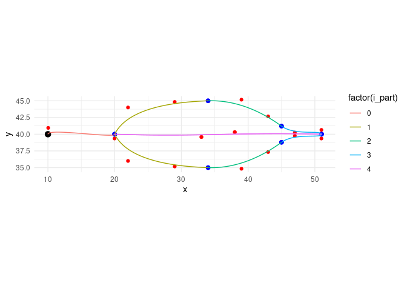
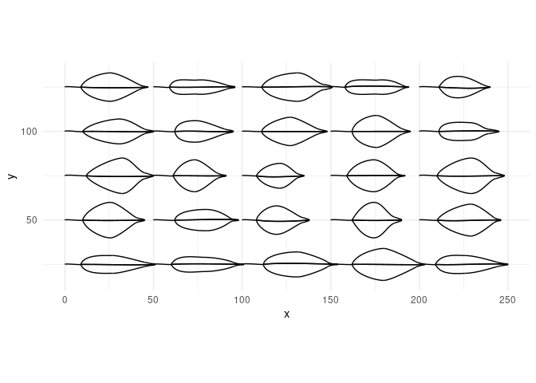
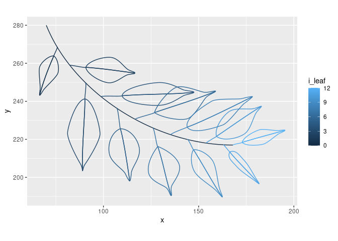
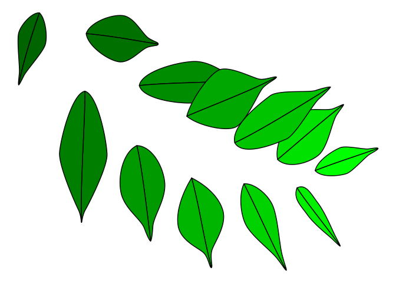

<!-- README.md is generated from README.Rmd. Please edit that file -->

# ggbenjamini

<!-- badges: start -->

[](https://lifecycle.r-lib.org/articles/stages.html#experimental)
[](https://CRAN.R-project.org/package=ggbenjamini)
[](https://github.com/urswilke/ggbenjamini/actions)
[](https://codecov.io/gh/urswilke/ggbenjamini?branch=main)
<!-- badges: end -->

## Generate benjamini leaves with bezier curves

The goal of this package is to generate shapes in the form of ficus
benjamina leaves ([weeping
fig](https://en.wikipedia.org/wiki/Ficus_benjamina)) with bezier curves.

## Installation

You can install the newest version of **ggbenjamini** from github with:

``` r
# install.packages("remotes")
# (if not installed yet)

remotes::install_github("urswilke/ggbenjamini")
```

## Usage

First load some libraries:

``` r
library(ggbenjamini)
library(purrr)
library(dplyr)
library(tidyr)
library(ggplot2)
set.seed(123)
```

## Illustration of the generated data

The package generates bezier curves that imitate the shape of the leaves
of a ficus benjamini. The main function is `benjamini_leaf()`:

``` r
df <- benjamini_leaf()
print(df, n = 40)
#> # A tibble: 36 × 5
#>    element i_part     x     y param_type            
#>    <chr>    <dbl> <dbl> <dbl> <chr>                 
#>  1 stalk        0  10    40   bezier start point    
#>  2 stalk        0  10.0  40.9 bezier control point 1
#>  3 stalk        0  20.0  39.4 bezier control point 2
#>  4 stalk        0  20    40   bezier end point      
#>  5 half 2       1  20    40   bezier start point    
#>  6 half 2       1  22    36   bezier control point 1
#>  7 half 2       1  29    35.2 bezier control point 2
#>  8 half 2       1  34    35   bezier end point      
#>  9 half 2       2  34    35   bezier start point    
#> 10 half 2       2  39    34.8 bezier control point 1
#> 11 half 2       2  43    37.3 bezier control point 2
#> 12 half 2       2  45    38.8 bezier end point      
#> 13 half 2       3  45    38.8 bezier start point    
#> 14 half 2       3  47    40.2 bezier control point 1
#> 15 half 2       3  51.0  39.4 bezier control point 2
#> 16 half 2       3  51    40   bezier end point      
#> 17 half 2       4  51    40   bezier start point    
#> 18 half 2       4  38    40.3 bezier control point 1
#> 19 half 2       4  33    39.6 bezier control point 2
#> 20 half 2       4  20    40   bezier end point      
#> 21 half 1       1  20    40   bezier start point    
#> 22 half 1       1  22    44   bezier control point 1
#> 23 half 1       1  29    44.8 bezier control point 2
#> 24 half 1       1  34    45   bezier end point      
#> 25 half 1       2  34    45   bezier start point    
#> 26 half 1       2  39    45.2 bezier control point 1
#> 27 half 1       2  43    42.7 bezier control point 2
#> 28 half 1       2  45    41.2 bezier end point      
#> 29 half 1       3  45    41.2 bezier start point    
#> 30 half 1       3  47    39.8 bezier control point 1
#> 31 half 1       3  51.0  40.6 bezier control point 2
#> 32 half 1       3  51    40   bezier end point      
#> 33 half 1       4  51    40   bezier start point    
#> 34 half 1       4  38    40.3 bezier control point 1
#> 35 half 1       4  33    39.6 bezier control point 2
#> 36 half 1       4  20    40   bezier end point
```

It results in a dataframe of multiple bezier curves representing the
shape of a leaf. The first column `element` indicates which part of the
leaf the bezier describes, and can take the values “stalk”, “half 2” and
“half 1”. `i_part` denotes the id of the bezier curve, and `x` & `y` its
point coordinates. The column `param_type` denotes the type of the point
in the bezier curve.

The meaning is best illustrated with a plot:

``` r
# rearrange data to display segments:
segments <- df %>% 
  select(-param_type) %>% 
  group_by(element, i_part) %>% 
  mutate(j = c(1, 2, 1, 2)) %>%
  ungroup() %>% 
  pivot_wider(
    names_from = j,
    values_from = c(x, y),
    values_fn = list
  ) %>% 
  unnest(c(x_1, x_2, y_1, y_2))

ggplot(df, aes(x = x, y = y)) + 
  geom_point(color = "red") +
  geom_point(data = df %>% group_by(element, i_part) %>% slice(c(1, 4)), color = "blue", size = 2) +
  geom_point(data = df %>% slice(1), color = "black", size = 3) +
  ggforce::geom_bezier(aes(group = interaction(element, i_part), color = factor(i_part))) +
  geom_segment(
    data = segments, 
    aes(
      x = x_1, 
      xend = x_2, 
      y = y_1, 
      yend = y_2
    ), 
    linetype = "dotted", 
    color = "red"
  ) +
  coord_equal() +
  theme_minimal()
```



The black point represents the leaf origin. This and the blue points
denote the start/end points of the bezier curves, and the red dots the
positions of the control points. The leaf is cut in two halves
(`element == "half 1" OR "half 2"`) by the lines where `i_part == 4`
(which represents the midvein of the leaf). The exact dimensions of
these coordinates are generated by random numbers in certain ranges (see
the definition of the argument `leaf_params` in `benjamini_leaf()`).

## Illustration of the randomness

In order to show the variations of the `benjamini_leaf()` (if parameters
are not explicitly specified), let’s only pass the position of the leaf
origins and let the function randomly generate the rest of the shapes:

``` r
dfb <- expand_grid(
    x = seq(0, 200, 50),
    y = seq(25, 125, 25)
) %>%
  transpose() %>%
  map_dfr(~benjamini_leaf(gen_leaf_parameters(x0 = .x$x, y0 = .x$y)), .id = "i_leaf") %>%
  unite(i, i_leaf, i_part, element, remove = FALSE)

ggplot(dfb) +
  ggforce::geom_bezier(aes(x = x, y = y, group = i)) +
  # geom_point(data = l_points %>% bind_rows(), aes(x = x, y = y), color = "red") +
  coord_equal() +
  theme_minimal()
```



## Branches

You can also generate branches of leaves with the command
`benjamini_branch()` (see the vignettes
`vignette("create_benjamini_polygons")` and
`vignette("create_benjamini_tree")` for examples):

``` r
df_branch <- benjamini_branch() %>%
  # we add a unique identifier `b` for all beziers:
  tidyr::unite(b, i_leaf, element, i_part, remove = FALSE) 
df_branch
#> # A tibble: 436 × 8
#>    b          i_leaf element i_part     x     y type        param_type          
#>    <chr>       <dbl> <chr>    <dbl> <dbl> <dbl> <chr>       <chr>               
#>  1 0_branch_1      0 branch       1  70    280  branch      bezier start point  
#>  2 0_branch_1      0 branch       1  84    245  branch      bezier control poin…
#>  3 0_branch_1      0 branch       1 126    217  branch      bezier control poin…
#>  4 0_branch_1      0 branch       1 168    217  branch      bezier end point    
#>  5 1_stalk_0       1 stalk        0  75.7  269. leaf_bezier bezier start point  
#>  6 1_stalk_0       1 stalk        0  76.2  268. leaf_bezier bezier control poin…
#>  7 1_stalk_0       1 stalk        0  73.8  264  leaf_bezier bezier control poin…
#>  8 1_stalk_0       1 stalk        0  74.0  264. leaf_bezier bezier end point    
#>  9 1_half 2_1      1 half 2       1  74.0  264. leaf_bezier bezier start point  
#> 10 1_half 2_1      1 half 2       1  71.4  264. leaf_bezier bezier control poin…
#> # … with 426 more rows
```

As the following plot also shows, `benjamini_branch()` adds another
column `i_leaf` specifying the index of the leaf on the branch.

``` r
df_branch %>%
  ggplot2::ggplot() +
  ggforce::geom_bezier(ggplot2::aes(x = x, y = y, group = b, color = i_leaf)) +
  ggplot2::coord_equal()
```



## Polygons

If you want to fill the leaves with color, you can use
`gen_leaf_bezier_coords()` to approximate the bezier curves leaf parts
with polygons:

``` r
df_polygons <- df_branch %>% 
  filter(stringr::str_detect(element, "^half [12]$")) %>%
  unite(idx, i_leaf, element, remove = FALSE) %>%
  gen_leaf_bezier_coords(idx, i_leaf, element, i_part, n = 100)
ggplot(
  data = df_polygons,
  aes(x = x, y = y, group = idx, fill = i_leaf)
) +
  geom_polygon(show.legend = FALSE, color = "black") +
  scale_fill_gradientn(colours = c("darkgreen", "green")) +
  theme_void() 
```



If you want to know more have a look in
`vignette("create_benjamini_polygons")` .

## svg

You can also transform the leaf data to svgs. Have a look in
`vignette("create_benjamini_svg")` for an example to generate svg
images.
