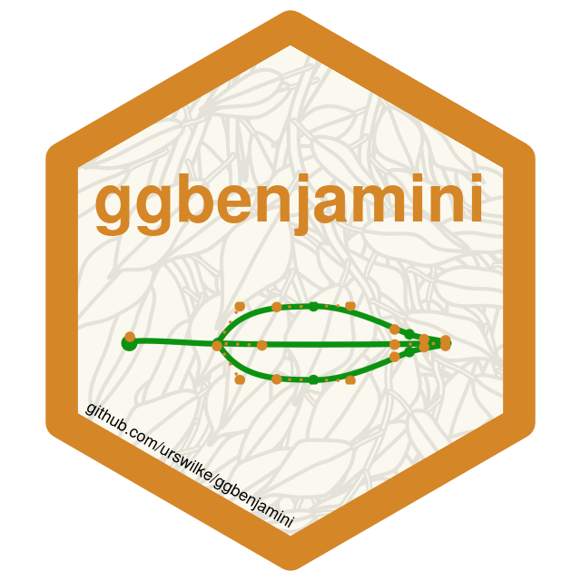

<!-- README.md is generated from README.Rmd. Please edit that file -->

# ggbenjamini 

<!-- badges: start -->

[](https://lifecycle.r-lib.org/articles/stages.html#experimental)
[](https://CRAN.R-project.org/package=ggbenjamini)
[](https://github.com/urswilke/ggbenjamini/actions)
[](https://codecov.io/gh/urswilke/ggbenjamini?branch=main)
<!-- badges: end -->

## Generate benjamini leaves with bezier curves

The goal of this package is to generate shapes in the form of ficus
benjamina leaves ([weeping
fig](https://en.wikipedia.org/wiki/Ficus_benjamina)) with bezier curves.
It is heavily inspired by the awesome
[flametree](https://flametree.djnavarro.net/) package.

## Installation

You can install the newest version of **ggbenjamini** from github with:

``` r
# install.packages("remotes")
# (if not installed yet)

remotes::install_github("urswilke/ggbenjamini")
```

## Usage

First load some libraries:

``` r
library(ggbenjamini)
library(purrr)
library(dplyr)
library(tidyr)
library(stringr)
library(ggplot2)
library(ggforce)
set.seed(123)
```

## Illustration of the generated data

The package generates bezier curves that imitate the shape of the leaves
of a ficus benjamini. The main function is `benjamini_leaf()`:

``` r
df <- benjamini_leaf()
```

<details>
<summary>
Show generated dataframe `df` of benjamini leaf bezier curve parameters
</summary>

``` r
knitr::kable(df)
```

| element | i_part |        x |        y | param_type             |
|:--------|-------:|---------:|---------:|:-----------------------|
| stalk   |      0 | 10.00000 | 40.00000 | bezier start point     |
| stalk   |      0 | 10.04566 | 40.94991 | bezier control point 1 |
| stalk   |      0 | 19.97942 | 39.35523 | bezier control point 2 |
| stalk   |      0 | 20.00000 | 40.00000 | bezier end point       |
| half 2  |      1 | 20.00000 | 40.00000 | bezier start point     |
| half 2  |      1 | 22.00000 | 36.00000 | bezier control point 1 |
| half 2  |      1 | 29.00000 | 35.17208 | bezier control point 2 |
| half 2  |      1 | 34.00000 | 35.00000 | bezier end point       |
| half 2  |      2 | 34.00000 | 35.00000 | bezier start point     |
| half 2  |      2 | 39.00000 | 34.82792 | bezier control point 1 |
| half 2  |      2 | 43.00000 | 37.33259 | bezier control point 2 |
| half 2  |      2 | 45.00000 | 38.78709 | bezier end point       |
| half 2  |      3 | 45.00000 | 38.78709 | bezier start point     |
| half 2  |      3 | 47.00000 | 40.24159 | bezier control point 1 |
| half 2  |      3 | 50.97942 | 39.35523 | bezier control point 2 |
| half 2  |      3 | 51.00000 | 40.00000 | bezier end point       |
| half 2  |      4 | 51.00000 | 40.00000 | bezier start point     |
| half 2  |      4 | 38.00000 | 40.31141 | bezier control point 1 |
| half 2  |      4 | 33.00000 | 39.58294 | bezier control point 2 |
| half 2  |      4 | 20.00000 | 40.00000 | bezier end point       |
| half 1  |      1 | 20.00000 | 40.00000 | bezier start point     |
| half 1  |      1 | 22.00000 | 44.00000 | bezier control point 1 |
| half 1  |      1 | 29.00000 | 44.82792 | bezier control point 2 |
| half 1  |      1 | 34.00000 | 45.00000 | bezier end point       |
| half 1  |      2 | 34.00000 | 45.00000 | bezier start point     |
| half 1  |      2 | 39.00000 | 45.17208 | bezier control point 1 |
| half 1  |      2 | 43.00000 | 42.66741 | bezier control point 2 |
| half 1  |      2 | 45.00000 | 41.21291 | bezier end point       |
| half 1  |      3 | 45.00000 | 41.21291 | bezier start point     |
| half 1  |      3 | 47.00000 | 39.75841 | bezier control point 1 |
| half 1  |      3 | 50.97942 | 40.64477 | bezier control point 2 |
| half 1  |      3 | 51.00000 | 40.00000 | bezier end point       |
| half 1  |      4 | 51.00000 | 40.00000 | bezier start point     |
| half 1  |      4 | 38.00000 | 40.31141 | bezier control point 1 |
| half 1  |      4 | 33.00000 | 39.58294 | bezier control point 2 |
| half 1  |      4 | 20.00000 | 40.00000 | bezier end point       |

</details>

<br>

It results in a dataframe of multiple bezier curves representing the
shape of a leaf. The first column `element` indicates which part of the
leaf the bezier describes, and can take the values “stalk”, “half 2” and
“half 1”. `i_part` denotes the id of the bezier curve, and `x` & `y` its
point coordinates. The column `param_type` denotes the type of the point
in the bezier curve.

The meaning is best illustrated with a plot:

<details>
<summary>
Show code to generate plot
</summary>

``` r
# rearrange data to display segments:
segments <- df %>% 
  select(-param_type) %>% 
  group_by(element, i_part) %>% 
  mutate(j = c(1, 2, 1, 2)) %>%
  ungroup() %>% 
  pivot_wider(
    names_from = j,
    values_from = c(x, y),
    values_fn = list
  ) %>% 
  unnest(c(x_1, x_2, y_1, y_2))

p <- ggplot(df, aes(x = x, y = y)) + 
  geom_point(color = "red") +
  geom_point(
    data = df %>% 
      group_by(element, i_part) %>% 
      slice(c(1, 4)),
    color = "blue", 
    size = 2
  ) +
  geom_point(
    data = df %>% slice(1), 
    color = "black", 
    size = 3
  ) +
  geom_bezier(
    aes(
      group = interaction(element, i_part), 
      color = factor(i_part)
    )) +
  geom_segment(
    data = segments, 
    aes(
      x = x_1, 
      xend = x_2, 
      y = y_1, 
      yend = y_2
    ), 
    linetype = "dotted", 
    color = "red"
  ) +
  coord_equal() +
  theme_minimal()
```

</details>


The black point represents the leaf origin. Together with the blue
points they denote the start/end points of the bezier curves, and the
red dots the positions of their control points. The leaf is cut in two
halves (`element == "half 1" OR "half 2"`) by the lines where
`i_part == 4` (which represents the midvein of the leaf). The exact
dimensions of these coordinates are generated by random numbers in
certain ranges (see the definition of the argument `leaf_params` in
`benjamini_leaf()`).

## Illustration of the randomness

In order to show the variations of the `benjamini_leaf()` (if parameters
are not explicitly specified), let’s only pass the position of the leaf
origins and let the function randomly generate the rest of the shapes:

``` r
dfb <- expand_grid(
    x = seq(0, 200, 50),
    y = seq(25, 125, 25)
) %>%
  transpose() %>%
  map_dfr(
    ~benjamini_leaf(gen_leaf_parameters(
      x0 = .x$x, 
      y0 = .x$y
    )), 
    .id = "i_leaf"
  ) %>%
  unite(i, i_leaf, i_part, element, remove = FALSE)

ggplot(dfb) +
  geom_bezier(aes(x = x, y = y, group = i)) +
  coord_equal() +
  theme_minimal()
```


## Branches

You can also generate branches of leaves with the command
`benjamini_branch()` (see the vignettes
`vignette("create_benjamini_polygons")` and
`vignette("create_benjamini_tree")` for examples):

``` r
df_branch <- benjamini_branch() %>%
  # we add a unique identifier `b` for all beziers:
  unite(b, i_leaf, element, i_part, remove = FALSE) 
df_branch
#> # A tibble: 436 × 8
#>    b          i_leaf element i_part     x     y type        param_type    
#>    <chr>       <dbl> <chr>    <dbl> <dbl> <dbl> <chr>       <chr>         
#>  1 0_branch_1      0 branch       1  70    280  branch      bezier start …
#>  2 0_branch_1      0 branch       1  84    245  branch      bezier contro…
#>  3 0_branch_1      0 branch       1 126    217  branch      bezier contro…
#>  4 0_branch_1      0 branch       1 168    217  branch      bezier end po…
#>  5 1_stalk_0       1 stalk        0  75.7  269. leaf_bezier bezier start …
#>  6 1_stalk_0       1 stalk        0  76.2  268. leaf_bezier bezier contro…
#>  7 1_stalk_0       1 stalk        0  73.8  264  leaf_bezier bezier contro…
#>  8 1_stalk_0       1 stalk        0  74.0  264. leaf_bezier bezier end po…
#>  9 1_half 2_1      1 half 2       1  74.0  264. leaf_bezier bezier start …
#> 10 1_half 2_1      1 half 2       1  71.4  264. leaf_bezier bezier contro…
#> # … with 426 more rows
```

As the following plot also shows, `benjamini_branch()` adds another
column `i_leaf` specifying the index of the leaf on the branch.

``` r
df_branch %>%
  ggplot() +
  geom_bezier(aes(x = x, y = y, group = b, color = i_leaf)) +
  coord_equal()
```


## Polygons

If you want to fill the leaves with color, you can use
`bezier_to_polygon()` to approximate the bezier curves leaf parts with
polygons:

``` r
df_polygons <- df_branch %>% 
  filter(str_detect(element, "^half [12]$")) %>%
  unite(idx, i_leaf, element, remove = FALSE) %>%
  bezier_to_polygon(idx, i_leaf, element, i_part, n = 100)
ggplot(
  data = df_polygons,
  aes(x = x, y = y, group = idx, fill = i_leaf)
) +
  geom_polygon(show.legend = FALSE, color = "black") +
  scale_fill_gradientn(colours = c("darkgreen", "green")) +
  theme_void() 
```


If you want to know more have a look in
`vignette("create_benjamini_polygons")` .

## svg

You can also transform the leaf data to svgs. Have a look in
`vignette("create_benjamini_svg")` for an example to generate svg
images.

<!-- 
The following as well as the bibtex file "pkg-refs.bib" were automatically
created with the commands:
library(grateful)
pkgs <- scan_packages()
# don't know why including "R" gives an error ??
pkgs <- pkgs[!pkgs %in% c("R", "ggbenjamini")] %>% c("magick")
cites <- get_citations(pkgs)
rmd <- create_rmd(cites)

-> then copy the list in the created refs.Rmd below

-->

## R packages used

This package stands on the shoulders of giants. It was only possible
thanks to the following libraries:

-   base (R Core Team 2021a)
-   tidyverse (Wickham et al. 2019)
-   ggforce (Pedersen 2021)
-   grid (R Core Team 2021b)
-   prismatic (Hvitfeldt 2021)
-   flametree (Navarro 2021)
-   rsvg (Ooms 2021b)
-   minisvg (FC 2021)
-   ambient (Pedersen and Peck 2020)
-   covr (Hester 2020)
-   stats (R Core Team 2021c)
-   magick (Ooms 2021a)

## References

<div id="refs" class="references csl-bib-body hanging-indent">

<div id="ref-minisvg" class="csl-entry">

FC, Mike. 2021. *Minisvg: SVG Document Builder*.

</div>

<div id="ref-covr" class="csl-entry">

Hester, Jim. 2020. *Covr: Test Coverage for Packages*.
<https://CRAN.R-project.org/package=covr>.

</div>

<div id="ref-prismatic" class="csl-entry">

Hvitfeldt, Emil. 2021. *Prismatic: Color Manipulation Tools*.
<https://CRAN.R-project.org/package=prismatic>.

</div>

<div id="ref-flametree" class="csl-entry">

Navarro, Danielle. 2021. *Flametree: Generate Random Tree-Like Images*.
<https://CRAN.R-project.org/package=flametree>.

</div>

<div id="ref-magick" class="csl-entry">

Ooms, Jeroen. 2021a. *Magick: Advanced Graphics and Image-Processing in
r*. <https://CRAN.R-project.org/package=magick>.

</div>

<div id="ref-rsvg" class="csl-entry">

———. 2021b. *Rsvg: Render SVG Images into PDF, PNG, PostScript, or
Bitmap Arrays*. <https://CRAN.R-project.org/package=rsvg>.

</div>

<div id="ref-ggforce" class="csl-entry">

Pedersen, Thomas Lin. 2021. *Ggforce: Accelerating ’Ggplot2’*.
<https://CRAN.R-project.org/package=ggforce>.

</div>

<div id="ref-ambient" class="csl-entry">

Pedersen, Thomas Lin, and Jordan Peck. 2020. *Ambient: A Generator of
Multidimensional Noise*. <https://CRAN.R-project.org/package=ambient>.

</div>

<div id="ref-base" class="csl-entry">

R Core Team. 2021a. *R: A Language and Environment for Statistical
Computing*. Vienna, Austria: R Foundation for Statistical Computing.
<https://www.R-project.org/>.

</div>

<div id="ref-grid" class="csl-entry">

———. 2021b. *R: A Language and Environment for Statistical Computing*.
Vienna, Austria: R Foundation for Statistical Computing.
<https://www.R-project.org/>.

</div>

<div id="ref-stats" class="csl-entry">

———. 2021c. *R: A Language and Environment for Statistical Computing*.
Vienna, Austria: R Foundation for Statistical Computing.
<https://www.R-project.org/>.

</div>

<div id="ref-tidyverse" class="csl-entry">

Wickham, Hadley, Mara Averick, Jennifer Bryan, Winston Chang, Lucy
D’Agostino McGowan, Romain François, Garrett Grolemund, et al. 2019.
“Welcome to the <span class="nocase">tidyverse</span>.” *Journal of Open
Source Software* 4 (43): 1686. <https://doi.org/10.21105/joss.01686>.

</div>

</div>
