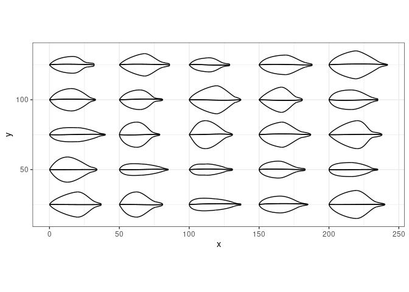

<!-- README.md is generated from README.Rmd. Please edit that file -->

# benjaminileaves

<!-- badges: start -->

[](https://lifecycle.r-lib.org/articles/stages.html#experimental)
[](https://CRAN.R-project.org/package=benjaminileaves)
<!-- badges: end -->

The goal of benjaminileaves is to …

## Installation

You can install the released version of benjaminileaves from
[CRAN](https://CRAN.R-project.org) with:

``` r
install.packages("benjaminileaves")
```

## Example

This is a basic example which shows you how to solve a common problem:

``` r
library(benjaminileaves)
library(purrr)
library(dplyr)
#> 
#> Attaching package: 'dplyr'
#> The following objects are masked from 'package:stats':
#> 
#>     filter, lag
#> The following objects are masked from 'package:base':
#> 
#>     intersect, setdiff, setequal, union
library(tidyr)
library(ggplot2)
```

What is special about using `README.Rmd` instead of just `README.md`?
You can include R chunks like so:

``` r
l_points <- expand_grid(
  x = seq(0, 200, 50),
  y = seq(30, 120, 30)
) %>%
  transpose() %>%
  map(~gen_benjamini_points(.x$x, .x$y))
l_slopes <-
  1:20 %>%
  map(~gen_benjamini_slopes())

dfb <- map2_dfr(
  l_points,
  l_slopes,
  get_bezier_df,
  .id = "leaf"
) %>%
  unite(i, i, leaf)
dfbr <- map2_dfr(
  l_points %>% map(rev_points),
  l_slopes %>% map(~.x %>% mutate(y = -y)),
  get_bezier_df,
  .id = "leaf"
) %>%
  unite(i, i, leaf) %>%
  mutate(i = paste0(i, "r"))

bezier_df <- bind_rows(
  dfb,
  dfbr
)

p <- ggplot(bezier_df) +
  ggforce::geom_bezier(aes(x = x, y = y, group = i)) +
  geom_point(data = l_points %>% bind_rows(), aes(x = x, y = y), color = "red") +
  coord_equal()
p
```


