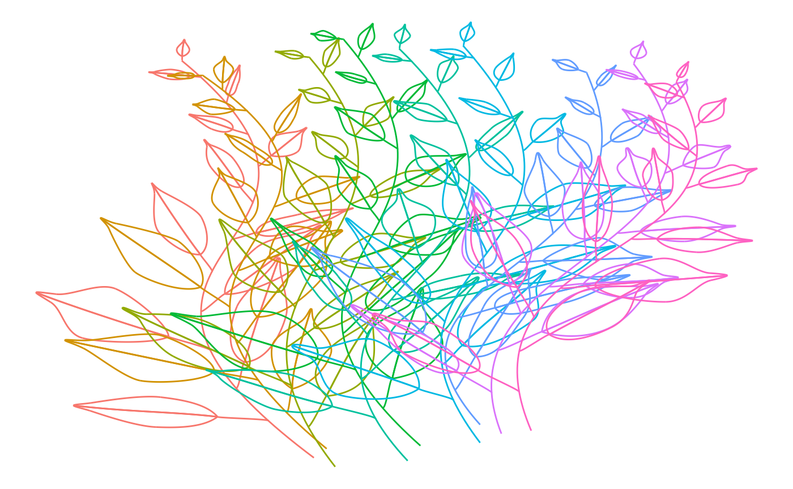
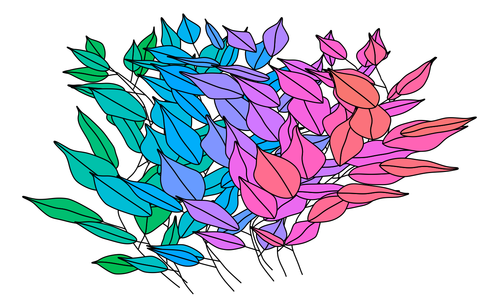

# Create polygons from benjamini leaves

In this vignette we’ll have a look how the leaves represented by the
bezier structures of
[`benjamini_leaf()`](https://urswilke.codeberg.page/ggbenjamini/reference/benjamini_leaf.md)
can be transformed to polygons.

Let’s first load the necessary packages:

``` r

library(ggbenjamini)
library(dplyr)
library(purrr)
library(tidyr)
library(stringr)
library(ggplot2)
library(ggforce)
library(ambient)

set.seed(123)
```

## Béziers

Now we’ll create a data structure consisting of multiple bezier curves
that we can use to grow branches after (DON’T TRY TO UNDERSTAND THIS
CODE! I’M SURE YOU COULD DO THAT MUCH BETTER…):

``` r

size <- 160
# df_branches <- tibble(
#   x = sample(1:size, 20, replace = TRUE), 
#   y = sample(1:size, 20, replace = TRUE), 
#   i_branch = rep(1:5, each = 4)
# )
xo = seq(-size/2, size/2, by = size/8) * 0.8
xm1 = xo * 0.75 - size/4
xm2 = xo * 0.75 + size/4
xu = xo * 0.5
y = rep(c(0.9, 0.5, 0.5, 0.1) * size, length(xo))
f <- function(xu, xm1, xm2, xo, y) {
  tibble(xu, xm1, xm2, xo) %>% 
    mutate(i_branch = row_number()) %>% 
    pivot_longer(-i_branch, values_to = "x") %>% 
    mutate(y = y) %>% 
    mutate()
}
df_branches <- f(xu, xm1, xm2, xo, y) %>% 
  mutate(x = x + size/2) %>% 
  mutate_at(
    c("x", "y"), 
    ~ .x + sample(
      (-size/20):(size/20), 
      length(xo), 
      replace = FALSE
    )
  )
df_branches
#> # A tibble: 36 × 4
#>    i_branch name      x     y
#>       <int> <chr> <dbl> <dbl>
#>  1        1 xu       54   149
#>  2        1 xm1     -14    77
#>  3        1 xm2      77    80
#>  4        1 xo       23    17
#>  5        2 xu       57   146
#>  6        2 xm1      -3    76
#>  7        2 xm2      81    74
#>  8        2 xo       28    22
#>  9        3 xu       59   152
#> 10        3 xm1      22    85
#> # ℹ 26 more rows
```

Now we can grow leaves on these branches:

``` r

df_branches_and_leaves <- df_branches %>% 
  group_split(i_branch) %>% 
  map_dfr(
    ~benjamini_branch(df_branch = .x[c("x", "y")]),
    .id = "i_branch"
  )
```

When we plot these bezier curves with ggplot2, we can color the outlines
of the different elements:

``` r

df_branches_and_leaves %>%
  unite(idx, i_branch, i_leaf, i_part, element, remove = FALSE) %>% 
  ggplot(aes(x = x, y = y, group = idx, color = factor(i_branch))) + 
  geom_bezier(show.legend = FALSE) +
  scale_y_reverse() +
  theme_void()
```



Quite messy, all these lines! In order for the leaves to cover what’s
below, have a look at the following section.

## Polygons

If we want to fill these shapes with color we can first approximate the
bezier curves with piecewise linear curves of length `n = 100` for each
bezier. Furthermore, we’ll add some simplex noise to make them look more
interesting:

``` r

df2 <- df_branches_and_leaves %>%
  unite(idx, i_branch, i_leaf, element, remove = FALSE) %>%
  bezier_to_polygon(idx, i_branch, i_leaf, element, i_part) %>% 
  mutate(
    x2 = x + gen_simplex(x, y, frequency = 0.05, seed = 123),
    y2 = y + gen_simplex(x, y, frequency = 0.05, seed = 123)
  )
```

Now we can plot them with `ggplot2`s
[`geom_path()`](https://ggplot2.tidyverse.org/reference/geom_path.html)
for the branch and the leaf stalks and
[`geom_polygon()`](https://ggplot2.tidyverse.org/reference/geom_polygon.html)
for the 2 leaf halves.

``` r

ggplot(
  data = df2 %>% 
    filter(str_detect(element, "^half [12]$")),
  aes(x = x2, y = y2, group = idx, fill = factor(idx))
) + 
  geom_path(
    data = df2 %>% 
      filter(!str_detect(element, "^half [12]$")), 
    aes(x = x2, y = y2, group = idx), 
    show.legend = FALSE, 
    color = "black"
  ) +
  geom_polygon(show.legend = FALSE, color = "black") +
  scale_y_reverse() +
  theme_void() 
```



If you look closely, you’ll see that the leaves cover all leaf stalks
and branches. This happens because in the ggplot, we first plot all
pathes and then all polygons.
