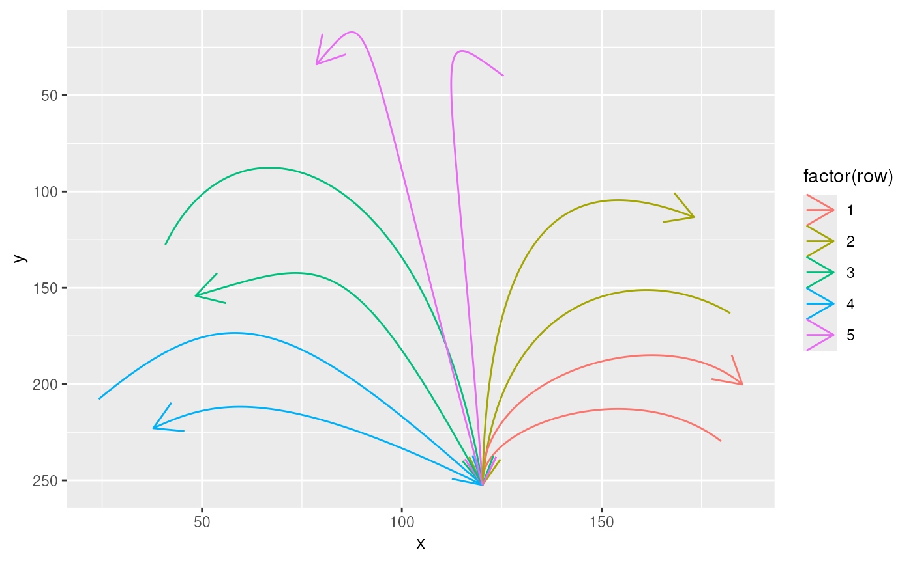
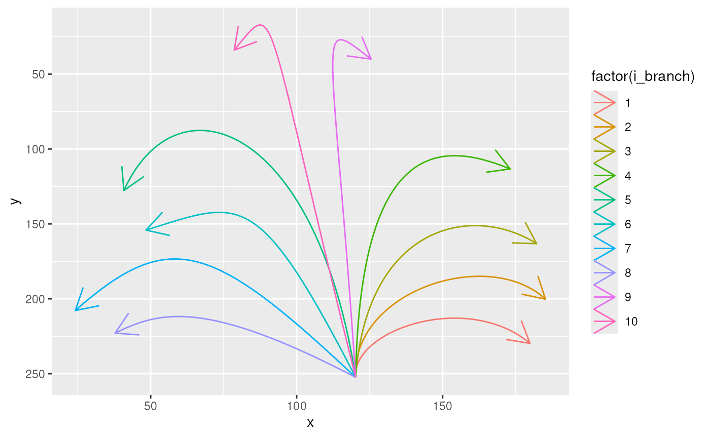

# Import bezier pathes from svg files

*Hacky and a bit off-topic…*

This vignette shows how you can import bezier path data from an svg file
and then transform the format to the one needed by
[`ggforce::geom_bezier()`](https://ggforce.data-imaginist.com/reference/geom_bezier.html).
Unless you really want to import bezier pathes from your svg file s, it
might not be of huge interest. What’s cool is that you can then draw
pathes with svg software such as inkscape. The resulting dataframe
`df_bezier_skeleton` of this vignette is also included in the package.
If you’re not interested in importing shapes from svg files you can just
have a look how this data can be used in
[`vignette("create_benjamini_svg")`](https://urswilke.codeberg.page/ggbenjamini/articles/create_benjamini_svg.md)
very result in a data frame of the svg file

``` r

library(ggbenjamini)
library(dplyr)
library(purrr)
library(tidyr)
library(ggplot2)
library(ggforce)
library(minisvg)
```

## Load the skeleton from the svg file

There is an svg file included in the package that will serve as a
skeleton of branches that we’ll grow the leaves on (*This file was
created with inkscape and then transformed with svgcairo to be in the
needed format for the following code.*). Let’s import it:

``` r

svg_skeleton <- system.file("extdata", "branch_skeleton.svg", package = "ggbenjamini")
```

## svg beziers to dataframe

Next we’ll load the svg object and extract the bezier curves into a
dataframe `df_svg_skeleton`:

``` r

svg_doc <- parse_svg_doc(svg_skeleton)

# you can descend in the elements of the object and find the part you're
# interested in. For this file we can extract our bezier pathes with:
pathes <- svg_doc$child$g[[1]]$child$path

path_strings <- map_chr(pathes, ~.x$attribs$d)


df_raw <- tibble(s = path_strings) %>%
  mutate(row = row_number()) %>%
  # separate the 2 parts of each curve
  separate_rows(s, sep = "(?=[mMcC] )") %>%
  filter(s != "") %>%
  separate(
    s, 
    c("svg_point_type", "coords"), 
    sep = " ",
    extra = "merge"
  ) %>%
  separate_rows(coords, sep = " ") %>%
  filter(coords != "") %>%
  mutate(coords = as.numeric(coords)) %>%
  mutate(i = ifelse(
    row_number() %% 2 == 1, 
    "x", 
    "y"
  )) %>%
  pivot_wider(
    values_from = coords, 
    names_from = i, 
    values_fn = list
  ) %>%
  unnest(c(x, y))

split_beziers <- function(df_bezier) {
  if (nrow(df_bezier) > 4) {
    n_others <- (nrow(df_bezier) - 4) / 3
    other_rows <- map(
      1:(n_others+1), 
      ~ 1:4 + (.x - 1) * 3
    ) %>% 
      unlist()
    res <- df_bezier[c(other_rows),] %>% 
      mutate(i_curve = rep(1:(n_others+1), each = 4))
  }
  if (nrow(df_bezier) == 4) {
    res <- df_bezier
  }
  res
}

(df_svg_skeleton <- df_raw %>%
  group_by(row) %>% 
  reframe(split_beziers(pick(dplyr::everything())))
)
#> # A tibble: 40 × 5
#>      row svg_point_type     x     y i_curve
#>    <int> <chr>          <dbl> <dbl>   <int>
#>  1     1 M               180.  230.       1
#>  2     1 C               158.  194.       1
#>  3     1 C               119.  221.       1
#>  4     1 C               120.  252.       1
#>  5     1 C               120.  252.       2
#>  6     1 C               119.  195.       2
#>  7     1 C               166.  165.       2
#>  8     1 C               185.  200.       2
#>  9     2 M               182.  163.       1
#> 10     2 C               160.  136.       1
#> # ℹ 30 more rows
```

Looking at the
[`geom_bezier()`](https://ggforce.data-imaginist.com/reference/geom_bezier.html)
plot,

``` r

df_svg_skeleton %>%
  # arrange(-row_number()) %>%
  ggplot(
    aes(
      x, 
      y, 
      group = interaction(row, i_curve), 
      color = factor(row)
    )
  ) +
  ggforce::geom_bezier(arrow = grid::arrow()) + 
  scale_y_reverse()
```



it’s as needed, but every second bezier is pointing in the wrong
direction and the bezier group indices are not very important. Let’s
correct this:

## Cleaning up

``` r

df_bezier_skeleton <- df_svg_skeleton %>%
  group_by(row, i_curve) %>%
  # correct direction of beziers with index i_curve == 1:
  slice(ifelse(i_curve %% 2 == 1, 4:1, 1:4)) %>% 
  # get rid of the pairing indices of this svg file and replace with
  # i_branch for each branch (only for clarity):
  mutate(i_branch = cur_group_id()) %>%
  ungroup() %>%
  select(-row, -i_curve) %>% 
  relocate(i_branch)
```

Now this looks better.

``` r

df_bezier_skeleton %>%
  ggplot(
    aes(
      x, 
      y,
      group = i_branch,
      color = factor(i_branch)
    )
  ) +
  ggforce::geom_bezier(arrow = grid::arrow()) +
  scale_y_reverse()
```



## `usethis::use_data()`

We’ll store this dataframe in the package.

``` r

usethis::use_data(df_bezier_skeleton, overwrite = TRUE)
#> ✔ Setting active project to
#>   "/woodpecker/src/codeberg.org/urswilke/ggbenjamini".
#> ✔ Saving "df_bezier_skeleton" to "data/df_bezier_skeleton.rda".
#> ☐ Document your data (see <https://r-pkgs.org/data.html>).
```
