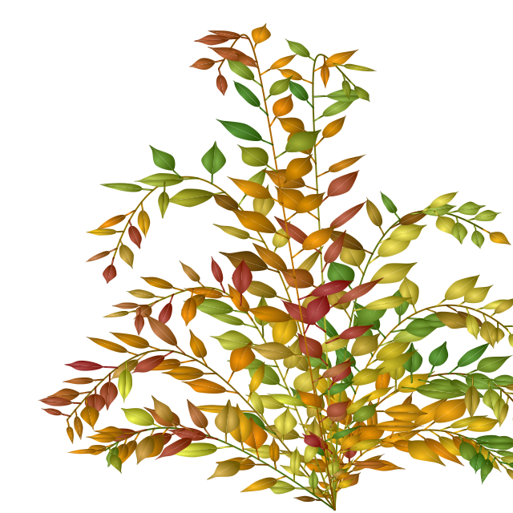

```{r, include = FALSE}
knitr::opts_chunk$set(
  collapse = TRUE,
  comment = "#>"
)
```

Let's have a look how the benjamini leaves can be integrated in svg files. First we'll load some libraries.

```{r setup, message=FALSE}
library(ggbenjamini)
library(dplyr)
library(purrr)
library(tidyr)
library(ggplot2)
library(stringr)
library(minisvg)

set.seed(21)
```

## Data preparation

Now we'll define a structure of bezier curves that we'll use as the coordinates for branches:

```{r}
size <- 640
df_branches <- tibble(
  x = sample(1:size, 20, replace = TRUE),
  y = sample(1:size, 20, replace = TRUE),
  bezier_idx = rep(1:5, each = 4)
)
```

Now let's grow leaves on these branches:

```{r}
df_branches_and_leaves <- df_branches %>% 
  group_split(bezier_idx) %>% 
  map_dfr(
    ~benjamini_branch(df_branch = .x[c("x", "y")], leaf_size_multiplicator = 4),
    .id = "bezier_idx"
  )
```

## ggplot2

Let's first plot this with ggplot2:

```{r}
df_branches_and_leaves %>%
  unite(idx, bezier_idx, i_leaf, i_part, element, remove = FALSE) %>% 
  ggplot(aes(x = x, y = y, group = idx, color = factor(bezier_idx))) + 
  ggforce::geom_bezier(show.legend = FALSE) +
  scale_y_reverse() +
  theme_void()
```

## svg

To plot an svg image, we'll first define a helper function to generate the "d" element of [svg path strings](https://developer.mozilla.org/en-US/docs/Web/SVG/Tutorial/Paths).

```{r}
get_svg_bezier_string <- function(bezier_df) {
  bezier_df %>%
    group_by(i_part) %>%
    slice(-1) %>%
    summarise(cb = paste(x, y, sep = ",", collapse = " ")) %>%
    pull(cb) %>%
    paste("C", ., collapse = " ") %>% 
    # paste("Z") %>% 
    paste0("M ", bezier_df$x[1], ",", bezier_df$y[1], " ", .)
}
```

Now we can add columns `path_str` with this "d" element and furthermore, we'll define different `fill_ _color`s for the varyous types of `element`s:

```{r}
df_svg <- df_branches_and_leaves %>% 
  group_by(bezier_idx, i_leaf, element) %>% 
  summarise(path_str =  get_svg_bezier_string(tibble(x, y, i_part))) %>% 
  mutate(fill_color = case_when(
    element == "half 1" ~ "url(#RadialGradient3)",
    element == "half 2" ~ "url(#RadialGradient4)",
    element == "stalk"  ~ "sandybrown",
    element == "branch"  ~ "brown"
  ))
  
df_svg
```


Now, we'll create a svg document object:
```{r}
doc <- SVGDocument$new(width = size, height = size)
```

In order to have some more realistic texture, we'll define gradients for the leaves:
```{r}
g3 <- stag$radialGradient(
  id = "RadialGradient3", cx="0.35", cy="0.63", r="0.7",
  stag$stop(offset = "0%", stop_color = "#00FF00"),
  stag$stop(offset = "100%", stop_color = "#008000")
)
g4 <- stag$radialGradient(
  id = "RadialGradient4", cx="0.5", cy="0.5", r="0.5",
  stag$stop(offset = "0%", stop_color = "#40DD40"),
  stag$stop(offset = "100%", stop_color = "#208020")
)
```

...and append them to the document:
```{r}
doc$append(g3, g4)
```

Here we define helper functions to append pathes as polygons or lines to the svg:

```{r}
append_polygon <- function(doc, path_str, fill_color) {
  doc$append(
    stag$path(
      d = path_str,
      fill=fill_color,
      fill_opacity="1"
    )
  )
}
append_line <- function(doc, path_str, fill_color) {
  doc$append(
    stag$path(
      d = path_str,
      stroke_width = "2",
      fill = "none",
      stroke=fill_color
    )
  )
}
append_element <- function(type, path_str, fill_color) {
  switch (
    type,
    "half 1" = ,
    "half 2" = append_polygon(doc, path_str, fill_color),
    "branch" = ,
    "stalk"  = append_line(doc, path_str, fill_color)
  )
  
}


```

Now we can finally append the branches with leaves to the svg:


```{r}
pwalk(list(
    df_svg$element,
    df_svg$path_str,
    df_svg$fill_color
  ),
  function(x, y, z) append_element(x, y, z)
)

```


Et voilà

```{r, eval=FALSE}
doc$show()
```

```{r, echo=FALSE}
doc$save("svg_vignette_output.svg")
rsvg::rsvg_png("svg_vignette_output.svg", "svg_vignette_output.png")

```

